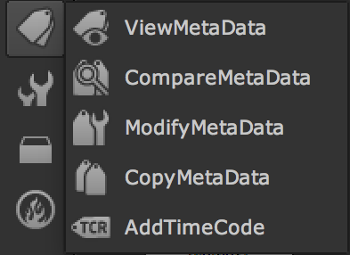

# Metadata

매타데이터란 이미지파일 내부에 사용자가 필요한 정보를 추가적으로 저장한 형태의 데이터를 뜻합니다. 사진이 촬영된 좌표 또는 카메라 정보등이 들어가있는 경우가 많습니다.

* 이미지의 메타데이터를 읽고, 비교, 수정, 복사, 추가할 때 사용합니다.
* 보통 영화작업시 키코드를 확인하거나, 데이터가 어느 툴에서 렌더링 되었는지, 촬영시간은 언제인지 등 체크시 사용합니다.
* 또한 보안을 위해서 일반 사진의 메타데이터의 사용자 정보\(촬영위치, 시간\)를 지울 때도 사용합니다.
* CG작업후에 원본의 메타데이터를 넣어서 아웃풋시에도 사용합니다.

