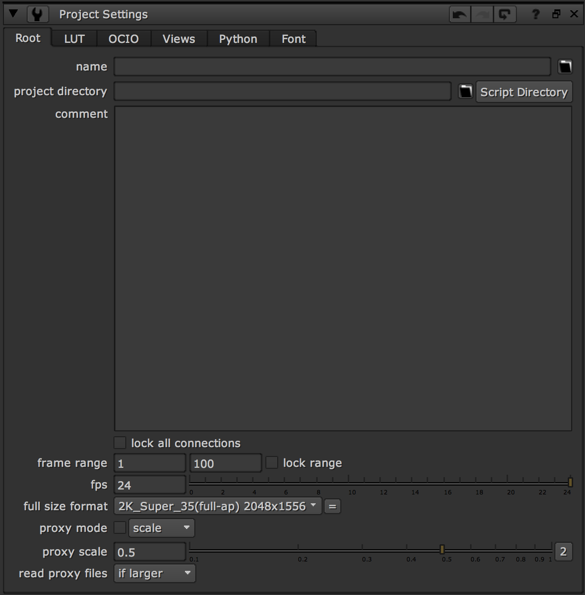
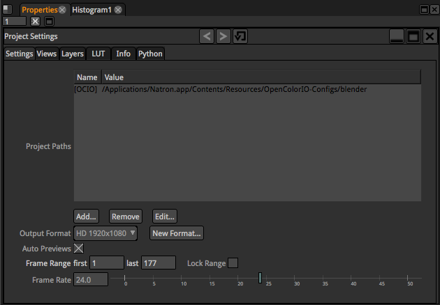

# ProjectSetting

## 작업 전에는 항상 프로젝트 셋팅을 먼저 합니다.

* 노드창에서 단축키 s 를 누르세요. 파라미터 창에 프로젝트 설정옵션이 뜹니다.
* 기본적으로 시작 프레임, 작업의 끝 프레임을 설정해줍니다.
* fps를 설정해줍니다.
* full size format \( 아웃풋 사이즈 \)를 설정합니다.
* 만약 아나모픽 렌즈를 사용했다면 format에서 Pixel Aspect값을 2로 설정해서 사용하세요.

## Tab에 대한 간단한 설명.

* LUT : 프로젝트에 사용할 LUT값을 설정할 수 있습니다.
* OCIO : OpencolorIO의 줄임말로 사용합니다.
* Views : 입체 작업시 사용합니다.

## Natron

* 동일하게 노드창에서 단축키 s 를 누르세요.

  

