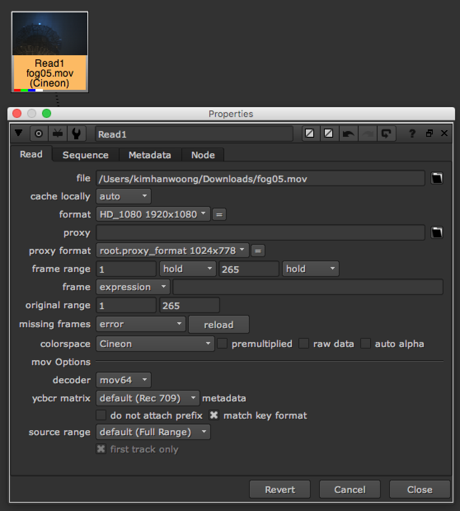

# Read\_Source

## 소스를 불러오는 방법을 배워봅시다.

> 툴바 &gt; Image &gt; Read \(Natron 동일\)

* 이미지를 불러올 때 사용하는 노드입니다.
* 이미지를 뉴크의 노드뷰어에 드레그 & 드롭해도 생성됩니다.
* 이미지가 들어있는 폴더를 뉴크의 노드뷰어에 드레그 & 드롭해도 Read노드는 생성됩니다.
* 노드뷰어에서 단축키 'R' 키를 누르고 불러올 소스를 선택할 수 있습니다.
* PSD 이미지를 로딩하면 PSD 레이어를 분리할 수 있는 버튼이 생성됩니다.
* 컬러가 이상하다면, Read노드에서 해당 소스의 Colorspace를 체크해주세요.

### PSD 예제이미지 다운로드

* [https://drive.google.com/open?id=0B3O\_eJlmdgJVd2hmdlNtYlFfS1k](https://drive.google.com/open?id=0B3O_eJlmdgJVd2hmdlNtYlFfS1k)
* 출처 : [http://livven.me/psds/htc-sense-clock-psd/](http://livven.me/psds/htc-sense-clock-psd/)

### 응용 : 익스프레션을 이용해서 상대경로로 이미지 불러오기

* 상대경로로 소스 불러오기 : `[file dirname [knob root.name]]`로 이미지의 경로를 시작합니다.

