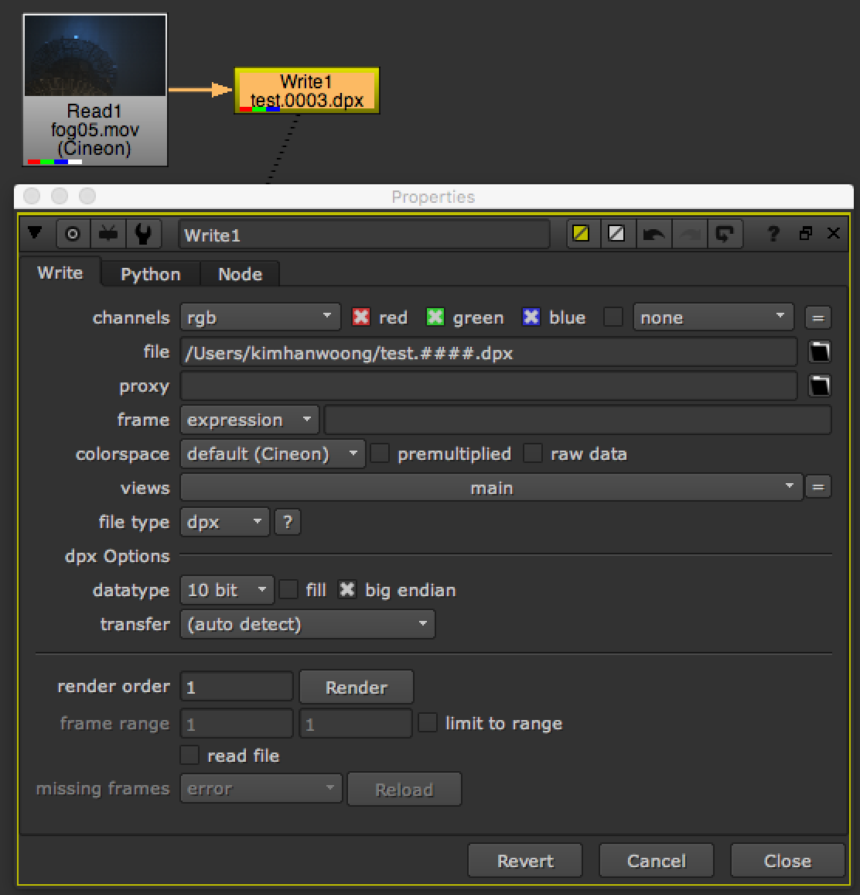

# Rendering

## 렌더링 하는 방법을 알아봅시다.

> 툴바 &gt; Image &gt; Write \(Natron 동일\)



* 기본적으로 노드에 Write노드가 존재해야 렌더링 할 수 있습니다.
* Write 노드를 만들때는 키보드 단축키 'w' 입니다.
* Write노드는 연산이 될 노드의 맨 마지막 줄기에 붙힙니다.
* 렌더링 이전에 렌더링 할 경로를 설정하는 방법은 다음과 같습니다.\(경로에 한글은 피해주세요.\)
* /경로1/경로2/파일명.\#\#\#\#.확장자
* 확장자에 따라서 Write노드의 옵션은 자동으로 바뀝니다.
* '\#' 하나는 시퀀스 숫자 한자리입니다. \#\#\#\#\# 처럼 '\#'이 5개이면, 00001형태로 연산됩니다.
* 보통은 4자리를 많이 사용합니다.
* 연결을 잘 했다면 Render 버튼을 누릅니다.

## 자세히

* 아웃풋 이름을 설정할 때 파일명.\#\#\#\#.확장자를 아래처럼 타이핑 해도 가능합니다. 프로그래머에게 익숙한 표기법입니다.

  ```text
  파일명.%04d.확장자
  ```

