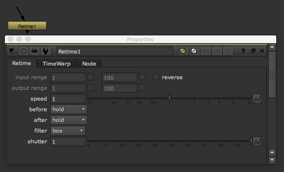

# Retime

* 이미지 시퀀스의 시간을 조절할 때 사용합니다.
* 움직임을 빠르게 만들고 싶거나, 느리게 만들고 싶을 때 사용합니다.
* 좋은 결과를 얻기 위해서 외부 플러그인을 사용하는 경우도 있습니다.

## 관련 외부 플러그인

* Revision Twixtor : [http://revisionfx.com/products/twixtor/](http://revisionfx.com/products/twixtor/)

