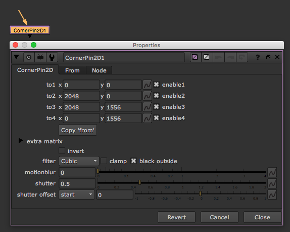

# Cornerpin\_node

* 4개의 점을 이용해서 이미지를 왜곡 시킬때 많이 사용합니다.
* 보통 핸드폰, 모니터 합성에서 많이 사용합니다.

## 예제파일

* 핸드폰화면 : [https://drive.google.com/open?id=0B3O\_eJlmdgJVa3o2VndEUmhxNTQ](https://drive.google.com/open?id=0B3O_eJlmdgJVa3o2VndEUmhxNTQ)
* 플레이트 : [https://drive.google.com/open?id=0B3O\_eJlmdgJVOENfV0ZYYkR2LXM](https://drive.google.com/open?id=0B3O_eJlmdgJVOENfV0ZYYkR2LXM)

