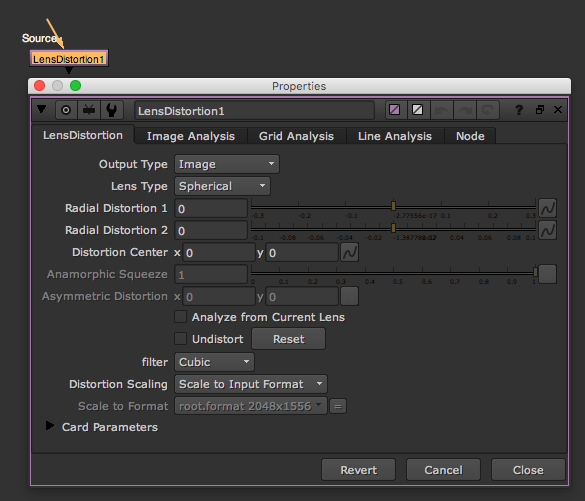

# LensDistortion\_node

* 뉴크 렌즈디스토션입니다.

## 실제로는..

* 회사에서 어떤 매치무브 툴을 사용하는지에 따라서 렌즈디스토션을 적용하는 노드는 달라집니다.
* 각 툴마다 렌즈 디스토션을 처리하는 과정이 다르기 때문입니다.
* 또한 각 툴마다 사용하는 뉴크 렌즈디스토션 노드도 다릅니다.
* 이 책은 기초내용을 목적으로 하고 회사마다 사용툴도 다르기 때문에 더 깊은 내용은 생략합니다.
* 보통 시장에서 사용하는 매치무브툴을 아래와 같습니다. 각 툴마다 다른 방식으로 렌즈디스토션을 폅니다.
  * 3D Equalizer : [https://www.3dequalizer.com](https://www.3dequalizer.com)
  * PF track : [http://www.thepixelfarm.co.uk/pftrack/](http://www.thepixelfarm.co.uk/pftrack/)
  * Synth eyes : [https://www.ssontech.com](https://www.ssontech.com)

