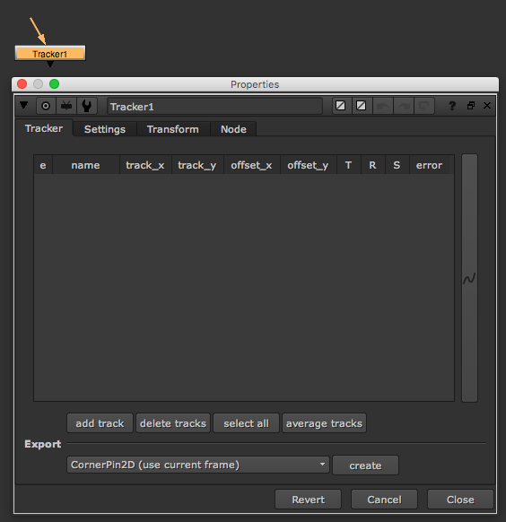

# Tracker\_node

* 이미지를 트레킹 할 때 사용합니다.
* 픽셀의 입자를 분석해서 트레킹하는 노드입니다.
* 입자의 특징을 분석하는 노드이기 때문에 플레이트에 디노이즈가 되어있다면 더 좋은 결과를 얻을 수 있습니다.
* 1포인트 트레킹 : 위치값을 얻을 수 있습니다.
* 2포인트 트레킹 : 위치, 회전값을 얻을 수 있습니다.
* 3포인트 트레킹 : 위치, 회전, 스케일값을 얻을 수 있습니다.
* 위 특징들을 잘 이용해서 트레킹 해봅시다.

## 예제파일

* 삼각대를 설치하지 않아서 떨고 있는 플레이트입니다.
* 픽셀을 트레킹하기에 좋은 예제를 링크했습니다. 소스를 다운로드해서 테스트 해주세요.
* [https://drive.google.com/open?id=0B3O\_eJlmdgJVbmFNMHNnWktybUU](https://drive.google.com/open?id=0B3O_eJlmdgJVbmFNMHNnWktybUU)

