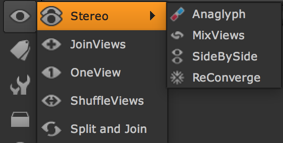
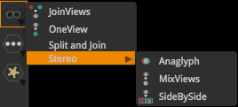

# Views



* 입체 작업시 많이 사용됩니다.
* 기본적으로는 left, right 이미지를 분리하거나 합치고, 특정 형태로 프리뷰하는 기능들로 구성되어있습니다.
* 실제 작업에서는 입체 플러그인 오큘라와 같이 활용됩니다.

## Ocula 문서

* [https://www.thefoundry.co.uk/support/user-guides/](https://www.thefoundry.co.uk/support/user-guides/)

## 입체 작업과 관련된 익스프레션

* Write노드에 아래처럼 타이핑하면 left, right이미지를 각각 렌더링할 수 있습니다.

  ```text
  SS_0010_comp_%V_v01.%04d.exr
  ```

* 위 형태로 입력하면 아래형태로 이미지 파일이 생성됩니다.

  ```text
  SS_0010_comp_left_v01.0001.exr
  SS_0010_comp_right_v01.0001.exr
  ```

### Natron



